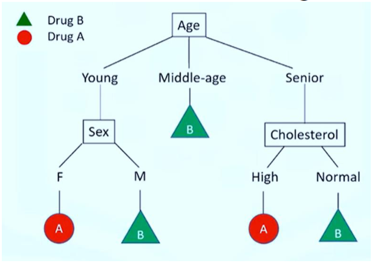
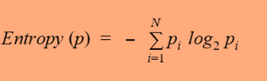
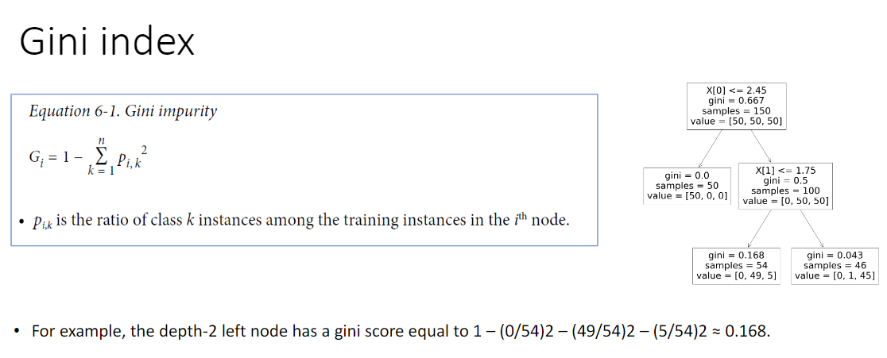

# Decision Trees

Main Characteristics
--------------------
    - Algorithm that can perform both classification and regression tasks, and even multioutput tasks. (PDF FOCUSES MOSTLY ON CLASSIFICATION) 
    - Works for both continuous and categorical attributes
    - No need to scale the data!
    - Small / Medium datasets

### Nodes of a Tree

    - Internal Nodes: each internal node is a condition
    - Leaf Nodes: each leaf assigns a classification

    - Every branch from root to leaf is a decision rule

Steps of learning a decision tree 
---------------------------------
    1. Choose an attribute from the data set
    2. Calculate the significance of the attribute in splitting of the data
    3. We will see more about it soon
    4. Split the data based on the value of the best attribute
    5. Go to step 1

Impurity and Entropy
--------------------
    Purity: A node is pure if in 100 percent of the cases, the nodes fall into a specific category of the target column.

    Entropy:
        - It is a measurement of randomness or uncertainty
        - So, we want less uncertainty, it means we want low entropy
        - Low entropy means impure
        - Lower the entropy, the purer the node
        - Lower the entropy in a node, more homogeneity of the samples

Information Gain
----------------
Information gain is the information that can increase the level of certainty after splitting
    
    - Information Gain = (Entropy before split) – (Weighted entropy after split)
        Note: As the entropy increases, the amount of information gain decreases

Types of Algorithms
-------------------
    ID3, C4.5, C5.0 and CART

    - ID3 (Iterative Dichotomiser 3) was developed in 1986 by Ross Quinlan. The algorithm creates a multiway tree, finding for each node (i.e. in a greedy manner) the categorical feature that will yield the largest information gain for categorical targets. Trees are grown to their maximum size and then a pruning step is usually applied to improve the ability of the tree to generalise to unseen data.

    - C4.5 is the successor to ID3 and removed the restriction that features must be categorical by dynamically defining a discrete attribute (based on numerical variables) that partitions the continuous attribute value into a discrete set of intervals. C4.5 converts the trained trees (i.e. the output of the ID3 algorithm) into sets of if-then rules. These accuracy of each rule is then evaluated to determine the order in which they should be applied. Pruning is done by removing a rule’s precondition if the accuracy of the rule improves without it.

    - C5.0 is Quinlan’s latest version release under a proprietary license. It uses less memory and builds smaller rulesets than C4.5 while being more accurate.

    - CART (Classification and Regression Trees) is very similar to C4.5, but it differs in that it supports numerical target variables (regression) and does not compute rule sets. CART constructs binary trees using the feature and threshold that yield the largest information gain at each node.
        - (scikit-learn uses an optimized version of CART that DOES NOT support categorical variables)

Gini Index
----------

Decision Tree Pruning
---------------------
    - Other algorithms work by first training the Decision Tree without restrictions, then pruning (deleting) 
    unnecessary nodes. 

    - A node whose children are all leaf nodes is considered unnecessary if the purity improvement it provides is 
    not statistically significant. 

    - Standard statistical tests, such as the χ2 test, are used to estimate the probability that the improvement is 
    purely the result of chance (which is called the null hypothesis). 

    - If this probability, called the pvalue, is higher than a given threshold (typically 5%, controlled by a 
    hyperparameter), then the node is considered unnecessary and its children are deleted. 
    
    - The pruning continues until all unnecessary nodes have been pruned.

Algorithms Comparisons
-----------------------
    Decision Tree vs SVM
        - SVM uses kernel trick to solve non-linear problems whereas decision trees derive hyper-rectangles in input space to solve the problem.
        - Decision trees are better for categorical data and it deals colinearity better than SVM.

    Decision Tree vs Logistic Regression
        - Decision tree handles colinearity better than LR.
        - Decision trees cannot derive the significance of features, but LR can.
        - Decision trees are better for categorical values than LR.

<!-- Comparisons Source: https://towardsdatascience.com/comparative-study-on-classic-machine-learning-algorithms-24f9ff6ab222 -->