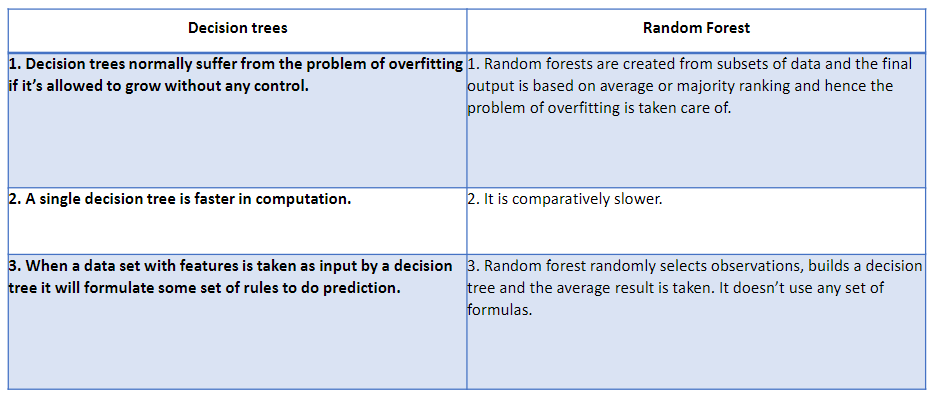
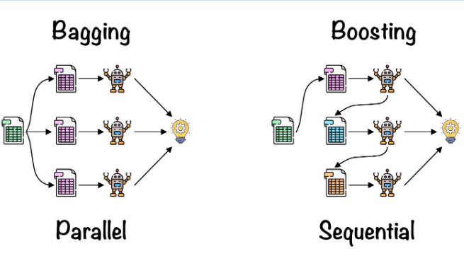

# Ensemble Learning, Random Forests and Boosting

Ensemble Learning
-----------------
    - Works like a "vote": there are multiple models grouped together that will make the final decision making

Voting Classifiers
------------------
    - Hard Voting: Choose the model the outcome that comes the most from models.
        Ex:
            x1 = 1
            x2 = 1
            x3 = 2
            x4 = 1

            Since there are more 1's, then the Hard Voting final decision is 1

    - Soft Voting: Take an average of all predictions and choose that (usually BETTER than HV)

Bagging and Pasting
-------------------
    Another approach is to use the same training algorithm for every predictor, but to train them on different random subsets of the training set. 

    - Bagging/"Bootstrap Aggregating": when sampling is done WITH REPLACEMENT
    - Pasting: when sampling is done WITHOUT REPLACEMENT

Out-of-Bag Evaluation
---------------------
    Out-of-Bag (OOB) evaluation or error is a method of measuring the prediction error of models using bagging (bootstrap aggregating)

  

# Random Forest
    Definition: Random Forest is an ensamble of Decision Trees, generally trained with bagging

Difference Between Decision Tree & Random Forest
------------------------------------------------

  

# Boosting (Hypothesis Boosting)
    Definition: Boosting is any ensemble method that can combine several weak learners into a strong learner. 

    - Popular Boosting methods are "AdaBoost" and "Gradient Boosting"

